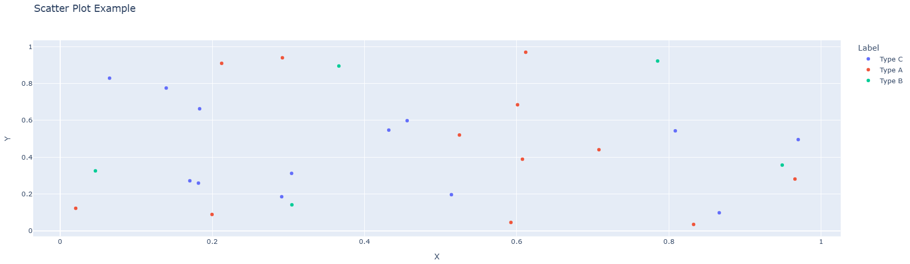
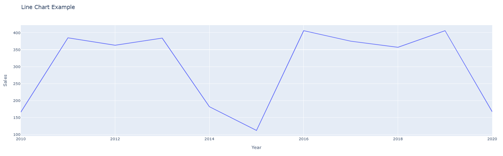
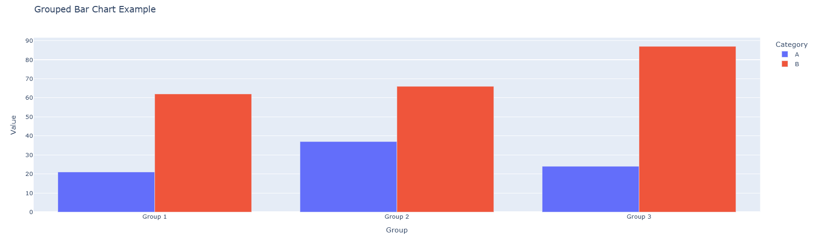
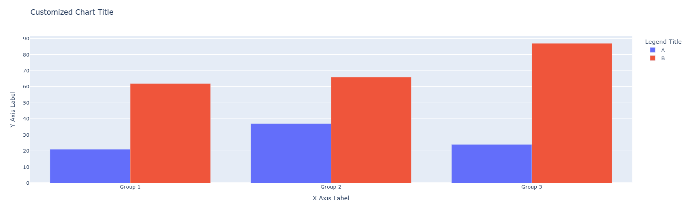
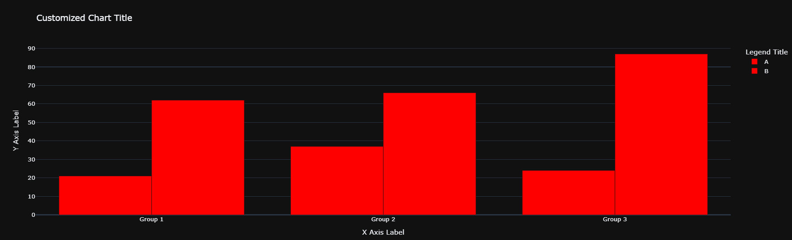

# Visualizing Data with Plotly

## Overview

In the previous lesson, you explored basic charts like scatter plots, bar charts, and histograms using `matplotlib`. In this lesson, you'll learn how to create interactive visualizations using a tool called Plotly.

## Learning Objective

By the end of this lesson you will be able to:

- Present data in more engaging and user-friendly formats.
- Create common chart types (histograms, scatter plots) with Plotly.
- Customize plots with titles, labels, and legends.

## Key terms

**Plotly:** an interactive, open-source, and browser-based graphing library for Python.

## Starter Code

This lesson encourages experimentation. Use the included [Collaboratory notebook](https://colab.research.google.com/drive/1UGBxHR7q9b-C39se9Nln-p2FAcxfLQfI?usp=sharing) to run the code as you learn, or read the lesson and then freely experiment with the notebook's code.

## Introduction

Plotly is a tool that helps you create **interactive** charts and graphs easily. Unlike regular charts, Plotly charts let you **zoom in, hover over points to see details, and even turn data on or off** by clicking the legend. Plotly allows data scientists to explore and present data in a visually engaging and interactive way. Think of it as a **"smart" graph maker** that lets you play with your data instead of just looking at it!

The following video presents

## Installing and Importing Plotly

Plotly comes pre-installed in **Google Colab**, so you can start using it right away without any additional setup. However, if you're using **Jupyter Notebook** or another local Python environment, you may need to install it using the following command:

```bash
pip install plotly
```

Once installed, you can import Plotly in your Python script or notebook like this:

```python
import plotly.express as px
import plotly.graph_objects as go
```

- **Plotly Express (`px`)** is a high-level interface that makes it easy to create quick and interactive visualizations with minimal code.  
- **Plotly Graph Objects (`go`)** provides more customization and control over chart elements.

After installation and import, you're ready to start creating interactive charts with Plotly!

## Creating Basic Charts

### Scatter plot

Recall that a scatter plot is used to display the relationship between two numerical variables, where each data point is represented by its coordinates on the x and y axes. This allows you to quickly identify trends, clusters, or outliers in your data.

In Plotly, creating a scatter plot is straightforward: you simply provide your DataFrame, the columns for the x and y axes, and optionally use additional parameters such as `color` or `symbol` to highlight different categories. For example, you can run `fig = px.scatter(df, x='columnX', y='columnY', color='category')` and then call `fig.show()` to generate an interactive scatter plot that displays tooltips, supports zooming, and allows you to toggle data series on or off.

First, create a sample dataset:

```python
# Create a new dataset for demonstration
df_scatter = pd.DataFrame({
    'X': np.random.rand(30),
    'Y': np.random.rand(30),
    'Label': np.random.choice(['Type A', 'Type B', 'Type C'], 30)
})
```

The code above creates a dataframe with 30 rows, where the **"X"** and **"Y"** columns contain random numbers between 0 and 1, and the **"Label"** column assigns each row a random category from **"Type A"**, **"Type B"**, or **"Type C"**.

Now, create the scatter plot from the sample dataset:

```python
fig = px.scatter(
    df_scatter,
    x='X',
    y='Y',
    color='Label',      # Points will have different colors based on Label
    title="Scatter Plot Example"
)
fig.show()
```

The code above takes data from the table (df_scatter), puts values from column "X" on the x-axis and values from column "Y" on the y-axis. The dots are colored differently based on the "Label" column (like grouping them into categories), and then it shows the chart so you can interact with it! The resulting graph looks like this:



### Line Chart

In the previous lesson, you learned that a line chart is used to display data points connected by straight lines, making it ideal for showing trends over time or ordered categories. Here's an example on how to create a line chart with Plotly:

First, create a sample dataset:

```python
# Create a new dataset for demonstration
df_line = pd.DataFrame({
    'Year': range(2010, 2021),
    'Sales': np.random.randint(100, 500, size=11)
})
```

The code above creates a dataframe with 11 rows, where the **"Year"** column contains years from 2010 to 2020, the **"Sales"** column contains random sales numbers.

Now, create the line chart from the sample dataset:

```python
fig = px.line(
    df_line,
    x='Year',
    y='Sales',
    title="Line Chart Example"
)
fig.show()
```

The code above takes data from the table (df_line), puts values from the "Year" column on the x-axis and values from the "Sales" column on the y-axis and then it shows the chart so you can interact with it! The resulting graph looks like this:



### Grouped Bar Chart

A grouped bar chart is used to compare multiple categories across different groups. Each group is represented by a set of bars, and each bar within the group represents a different category. In Plotly, you can create a grouped bar chart using `plotly.express` or `plotly.graph_objects`. Here's an example using `plotly.express`:

First, create a sample dataset:

```python
# Create a new dataset for demonstration
df_bar = pd.DataFrame({
    'Group': ['Group 1', 'Group 1', 'Group 2', 'Group 2', 'Group 3', 'Group 3'],
    'Category': ['A', 'B', 'A', 'B', 'A', 'B'],
    'Value': np.random.randint(10, 100, size=6)
})
```

The code above creates a dataframe with 6 rows, where the **"Group"** column contains the group names, the **"Category"** column contains the categories, and the **"Value"** column contains random values.

Now, create the grouped bar chart from the sample dataset:

```python
fig = px.bar(
    df_bar,
    x='Group',
    y='Value',
    color='Category',      # Bars will have different colors based on Category
    barmode='group',       # Grouped bar chart
    title="Grouped Bar Chart Example"
)
fig.show()
```

The code above takes data from the table (df_bar), puts values from the "Group" column on the x-axis and values from the "Value" column on the y-axis. The bars are colored differently based on the "Category" column, and the `barmode='group'` parameter ensures that the bars are grouped by the "Group" column. The resulting graph looks like this:



## Customizing Plots

### Adding Titles, Labels, and Legends

You can customize your Plotly charts by adding titles, axis labels, and legends. Here's how you can do it:

```python
fig.update_layout(
    title="Customized Chart Title",
    xaxis_title="X Axis Label",
    yaxis_title="Y Axis Label",
    legend_title="Legend Title"
)
fig.show()
```


### Changing Colors and Themes

Plotly allows you to change the colors and themes of your charts. You can use predefined color sequences or create your own custom color schemes. Here's an example:

```python
fig.update_traces(marker=dict(color='red'))  # Change marker color
fig.update_layout(template='plotly_dark')    # Change theme to dark
fig.show()
```



## Conclusion

In this lesson, you learned how to create interactive visualizations using Plotly. You explored how to create scatter plots, line charts, and grouped bar charts, and how to customize them with titles, labels, legends, colors, and annotations. Plotly's interactive features make it a powerful tool for data exploration and presentation, allowing you to create engaging and user-friendly visualizations.
